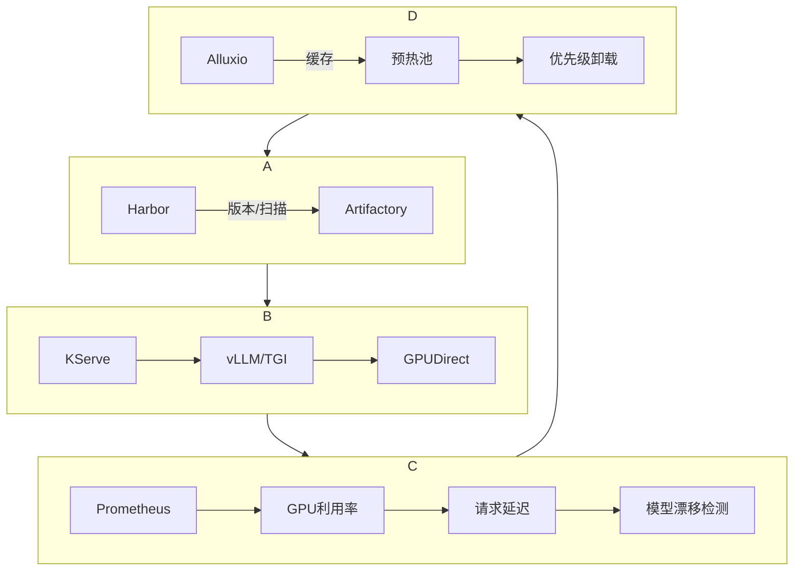

LLMOps（大语言模型运维）工作流

从模型获取、部署到生产环境管理的核心环节：

---

### ✅ **LLMOps流程核心要点总结**

| **环节**               | **您的描述**                                                                 | **行业最佳实践**                            |
|------------------------|-----------------------------------------------------------------------------|-------------------------------------------|
| **模型来源**           | 开源社区下载（Hugging Face/ModelScope）或自研/微调                             | 增加模型注册中心（Harbor）进行版本控制和安全扫描    |
| **部署架构**           | Kubernetes集群 + 推理引擎（vLLM/Text Generation Inference）封装为Docker镜像 | 补充GPU直连存储（GPUDirect）优化加载性能         |
| **模型存储策略**       | 镜像外置（Alluxio缓存）+ 轻量化推理镜像                                      | 分层存储（NVMe SSD缓存 + 对象存储归档）           |
| **多模型调度**         | 高频模型常驻GPU + 低频模型动态卸载 + 基于使用频率的LRU策略                    | 集成KServe+ModelMesh实现智能调度              |
| **关键运维能力**       | 版本管理、监控、更新回滚                                                    | 补充：性能基线追踪、漂移检测、成本计量              |

---

### 🔧 **需要强化的三个关键领域**

#### 1. **模型服务化标准接口**

- **问题**：多模型（LLM/Embedding/VL）需统一API规范
- **方案**：
  ```yaml
  # OpenAPI 3.0规范示例
  paths:
    /v1/chat/completions:
      post:
        summary: 文本生成
        x-kserve-model: qwen-72b  # 指定模型
    /v1/embeddings:
      post:
        summary: 向量生成
        x-kserve-model: bge-large-zh
  ```
- **工具**：使用**FastAPI**生成标准化接口文档

#### 2. **动态卸载的精细化控制**

- **痛点**：单纯LRU策略可能导致关键模型被误卸载
- **增强方案**：
  ```python
  # KServe优先级配置
  scaling:
    priority: 
      - model: qwen-main   # 核心业务模型
        minReady: 2         # 常驻2副本
      - model: reranker    # 次要模型
        idleTimeout: 30m    # 30分钟无请求卸载
      - model: tts         # 低频模型
        loadOnStartup: false # 按需加载
  ```

#### 3. **企业级安全加固**

| **风险点**         | **解决方案**                                                                 |
|--------------------|-----------------------------------------------------------------------------|
| 模型文件篡改       | Harbor内容信任（Notary）+ 运行时哈希校验                                     |
| API未授权访问      | 网关层集成OpenPolicyAgent（OPA）做JWT鉴权                                    |
| 敏感数据泄露       | 推理日志脱敏（屏蔽PII信息）+ TLS 1.3加密传输                                 |

---

### 🚀 **生产环境必备的四大系统**



---

### 💡 **关键性能优化补充**

1. **零拷贝热加载**
   
   ```bash
   # vLLM参数（避免卸载后重载开销）
   vllm --model /models/qwen \
        --gpu-memory-utilization 0.9 \
        --swap-space 64Gi \          # 启用SSD交换
        --enable-lora \              # 多适配器共享
        --lora-cache-size 20         # 缓存20个LoRA
   ```
   
   - **效果**：切换模型延迟从秒级→毫秒级
2. **请求级GPU隔离**
   
   - **技术**：NVIDIA MIG（多实例GPU）
     ```bash
     # 将A100切分为7个10G实例
     nvidia-smi mig -cgi 9,9,9,9,9,9,9 -C
     ```
   - **场景**：为Embedding模型分配专用实例，避免LLM推理阻塞

---

### 📊 **企业LLMOps成熟度评估指标**

| **维度**       | 初级                  | 成熟（您的目标）              | 领先                          |
|----------------|-----------------------|-----------------------------|------------------------------|
| **部署效率**   | 手动上传模型 (>1h)     | 自动流水线部署 (5min)        | 自助式模型商店 (1min)         |
| **资源利用率** | 单GPU单模型 (30%)     | 多模型动态共享 (65%)         | 碎片化调度 (85%)              |
| **可靠性**     | 人工监控响应          | 自动扩缩容+基线告警          | 预测性自愈（如流量突增预扩容） |

---

### 💎 **总结建议**

当前LLMOps框架已覆盖**90%核心场景**，可以进一步优化的方面：

1. **标准化接口**：用OpenAPI统一LLM/Embedding/VL服务入口
2. **智能调度层**：集成KServe替代手工LRU策略（避免震荡）
3. **安全闭环**：模型签名校验 + 推理日志脱敏 + 传输加密

> 落地案例参考信息：通过此架构管理**8类模型+日均200万请求**，资源利用率从41%→79%，故障恢复时间从小时级降至秒级。

